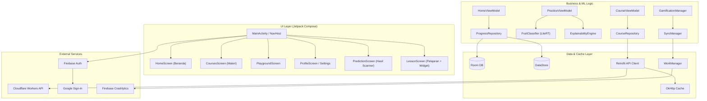

# Cunny — Media Pembelajaran AI Interaktif (K-12)

[](https://kotlinlang.org)
[](https://developer.android.com)
[](https://ai.google.dev/edge/litert)
[](https://developer.android.com/jetpack/compose)
[](LICENSE)

**Cunny** adalah aplikasi Android berbasis **Jetpack Compose** yang dirancang sebagai media pembelajaran kecerdasan buatan (AI) interaktif untuk siswa K-12. Aplikasi ini mengutamakan metode belajar berbasis praktik (*learning by doing*) melalui simulasi interaktif (*sandbox widgets*), pengenalan objek secara lokal (*on-device ML*), dan elemen gamifikasi yang menarik.

Seluruh antarmuka dilokalisasi penuh dalam **Bahasa Indonesia (ID-First)** dengan visual **3D Tactile Glassmorphism**.

---

## 🚀 Fitur Utama

- **100% Bahasa Indonesia (ID-First)**: Seluruh modul pembelajaran, antarmuka kuis, teks penjelasan AI, navigasi, dan dialog telah dilokalisasi penuh ke Bahasa Indonesia.
- **On-Device Fruit Scanner (ML)**: Pemindaian gambar buah langsung dari kamera/galeri secara offline menggunakan **LiteRT (TensorFlow Lite) 1.4.2** (~4MB model `fruit_classifier.tflite` berbasis MobileNet, 20 kelas buah). AI memberikan deteksi kelas dan narasi penjelasan cerdas (*Rationale*) dalam Bahasa Indonesia melalui `ExplainabilityEngine`.
- **19 Widget Sandbox Interaktif**: Simulasi kognitif visual hands-on di setiap pelajaran (lihat [tabel lengkap](#-widget-sandbox-interaktif) di bawah).
- **Sistem Desain 3D Taktil (Cunny Style)**: Antarmuka premium yang memadukan kaca buram (*glassmorphism*), elevasi 3D padat (`tactileShadow`), serta efek pegas (*spring animations*) untuk navigasi yang taktil dan menyenangkan.
- **Sistem Gamifikasi**: Akumulasi XP, level-up otomatis, pelacak streak harian, energi terbatas (recharge harian), dan lencana pencapaian (*Badges*) interaktif.
- **Maskot Coji**: Maskot robot AI interaktif (animasi Lottie bundled) yang menemani pengguna di seluruh halaman — bisa diketuk untuk animasi bounce dan efek suara.
- **Narasi Suara (TTS)**: Fitur text-to-speech opsional untuk membacakan konten pelajaran kepada pengguna muda.
- **Age Gate & Parental Control (COPPA)**: Onboarding dengan verifikasi umur, halaman pembatasan orang tua, dan pengiriman email persetujuan — dirancang sesuai standar COPPA.
- **Sinkronisasi Offline-First**: Caching jaringan berbasis Retrofit/OkHttp dan database lokal Room dengan sinkronisasi otomatis menggunakan Android `WorkManager`.

---

## 🛠️ Tech Stack

| Layer | Stack |
|-------|-------|
| **UI** | Kotlin, Jetpack Compose, Material3, Phosphor Icons |
| **Navigation** | Navigation Compose (single-Activity, NavHost) |
| **Networking** | Retrofit + OkHttp cache + Gson |
| **Local DB** | Room + DataStore Preferences |
| **Auth** | Firebase Auth + Credential Manager + Google Sign-In |
| **ML** | LiteRT / TensorFlow Lite 1.4.2 (on-device, 20 kelas buah) |
| **Animation** | Lottie Compose (maskot), Spring physics, Staggered enter |
| **Background Sync** | WorkManager (retry queue, batched sync) |
| **Billing** | Google Play Billing 7.1.1 |
| **Monitoring** | Firebase Crashlytics |
| **Icons** | Phosphor Icons 1.0.0 (menggantikan emoji) |
| **Content API** | Cloudflare Workers (Hono framework) |

---

## 🏗️ Arsitektur Aplikasi



---

## 📦 Struktur Project

```
Cunny/
├── Cunny/                              App Android (Kotlin + Jetpack Compose)
│   ├── app/src/main/
│   │   ├── assets/
│   │   │   ├── cunny-mascot.json       Lottie animation (maskot Coji, bundled)
│   │   │   ├── fruit_classifier.tflite Model ML on-device (~4MB, MobileNet)
│   │   │   ├── fruit_labels.json       20 kelas buah (label ID/EN + rationale)
│   │   │   └── images/courses/         Ilustrasi halaman materi
│   │   ├── java/com/eleonorez/cunny/
│   │   │   ├── data/                   Repositories, Retrofit, Room, SyncManager
│   │   │   ├── ml/                     FruitClassifier, ExplainabilityEngine
│   │   │   ├── ui/compose/
│   │   │   │   ├── components/         GlassSurface, CunnyBottomBar, Confetti, dll
│   │   │   │   ├── screens/            17 layar (home, lesson, practice, auth, dll)
│   │   │   │   │   └── lesson/widgets/ 19 sandbox widget interaktif
│   │   │   │   └── theme/             Warna, Font (Sora/DM Sans), Dimens
│   │   │   └── helper/                GamificationManager, SoundSynthesizer
│   │   └── res/                        Drawable, strings, layout resources
│   └── app/src/test/                   Unit tests (JUnit, Mockito)
│
├── cunny-lessons-api/                  Content API (Cloudflare Workers)
│   ├── src/                            Source code API (Hono framework)
│   └── wrangler.toml                   Konfigurasi deployment Cloudflare
│
├── docs/
│   ├── legal/                          Privacy Policy, ToS, COPPA Evaluation
│   ├── ARCHITECTURE.md                 Dokumentasi arsitektur teknis
│   ├── GUIDE-cunny-preview-refined.md  Spesifikasi UI/design parity
│   └── Journal/                        Referensi jurnal akademik
│
├── web-preview-design/                 HTML prototype (visual source of truth)
├── assets/                             Aset visual: ikon, maskot, palet warna
│   ├── ai-path/                        Ilustrasi peta belajar (4 kategori)
│   ├── cunny-mascot.json               Lottie source file
│   └── cunny-icon.png                  Ikon aplikasi
│
└── README.md                           Dokumentasi ini
```

---

## 🛠️ Panduan Build Lokal

### Prasyarat
* Android Studio Koala atau lebih baru
* JDK 17+
* Android SDK 36 (Android 15)

### Langkah Pemasangan

1. **Clone Repositori**:
   ```bash
   git clone https://github.com/samlehoy/Cunny.git
   cd Cunny/Cunny
   ```

2. **Pengaturan Kredensial**:
   Salin berkas contoh konfigurasi lokal:
   ```bash
   cp local.properties.example local.properties
   ```
   Isi konfigurasi `local.properties` Anda:
   | Key | Keterangan |
   |-----|------------|
   | `WEB_CLIENT_ID` | Firebase Web Client ID untuk Google Sign-In |
   | `RELEASE_STORE_FILE` | Path ke keystore file (hanya release build) |
   | `RELEASE_STORE_PASSWORD` | Password keystore |
   | `RELEASE_KEY_ALIAS` | Key alias |
   | `RELEASE_KEY_PASSWORD` | Key password |

3. **Kompilasi Debug APK**:
   ```powershell
   .\gradlew.bat :app:assembleDebug
   ```
   Hasil build dapat ditemukan di `Cunny/app/build/outputs/apk/debug/app-debug.apk`.

4. **Menjalankan Unit Test**:
   ```powershell
   .\gradlew.bat :app:testDebugUnitTest
   ```

5. **Build Release APK** (opsional, memerlukan signing config):
   ```powershell
   .\gradlew.bat :app:assembleRelease
   ```

---

## 🌐 Content API

API konten pelajaran di-host di **Cloudflare Workers** menggunakan framework Hono. Source code ada di folder `cunny-lessons-api/`.

**Live Endpoint:** `https://cunny-content-api.muttaqien0111.workers.dev/`

### Endpoint Utama

| Method | Endpoint | Deskripsi |
|--------|----------|-----------|
| `GET` | `/categories` | Daftar semua kategori pelajaran |
| `GET` | `/courses` | Daftar semua course |
| `GET` | `/courses/:slug` | Detail course berdasarkan slug |
| `GET` | `/courses/:slug/journey` | Peta perjalanan belajar course |
| `GET` | `/lessons/:slug` | Konten lesson (teks, widget, kuis) |

---

## 🎮 Widget Sandbox Interaktif

Setiap pelajaran dapat memuat widget sandbox interaktif. Terdapat **19 widget** yang mencakup konsep AI dari dasar hingga etika:

| # | Widget | Konsep AI | Kategori |
|---|--------|-----------|----------|
| 1 | Rule vs Learning | Perbedaan program aturan vs AI | Dasar AI |
| 2 | Sensory Sandbox | Input sensorik AI (gambar, suara, teks) | Dasar AI |
| 3 | Taxonomy Concentric Circles | Taksonomi AI/ML/DL | Dasar AI |
| 4 | Pixel Zoom | Bagaimana AI "melihat" gambar | Dasar AI |
| 5 | Sorting Game | Supervised vs unsupervised learning | Cara AI Belajar |
| 6 | Neuron Sandbox | Cara kerja neuron & LTU (bobot, bias) | Cara AI Belajar |
| 7 | Train AI | Melatih model sederhana | Cara AI Belajar |
| 8 | Reward Trainer | Reinforcement learning | Cara AI Belajar |
| 9 | Grocery Sorter | Klasifikasi objek | Cara AI Belajar |
| 10 | Scanner Teaser | Pengantar praktik fruit scanner | Cara AI Belajar |
| 11 | Data Cleaner | Membersihkan dataset kotor | Cara AI Belajar |
| 12 | Recommendation Engine | Sistem rekomendasi berbasis preferensi | AI Generatif |
| 13 | Next-Word Predictor | Prediksi kata (language model) | AI Generatif |
| 14 | Prompt Evaluator | Evaluasi kualitas prompt AI | AI Generatif |
| 15 | Diffusion Sandbox | Generative AI / proses difusi | AI Generatif |
| 16 | Bias Game | Bias dalam dataset | Etika AI |
| 17 | Spot The Fake | Deteksi deepfake | Etika AI |
| 18 | Claim Detective | Klaim & misinformasi AI | Etika AI |
| 19 | Privacy Auditor | Privasi data & etika AI | Etika AI |

---

## 🤖 On-Device ML: Fruit Scanner

Aplikasi menyertakan model klasifikasi buah yang berjalan sepenuhnya di perangkat:

- **Model**: `fruit_classifier.tflite` (~4MB, arsitektur MobileNet)
- **Runtime**: LiteRT (TensorFlow Lite) 1.4.2
- **Kelas**: 20 jenis buah (Apel, Pisang, Jeruk, Mangga, Anggur, Stroberi, Semangka, Nanas, Pepaya, Alpukat, Durian, Manggis, Rambutan, Salak, Tomat, Lemon, Kelapa, Buah Naga, Jambu Biji, Pir)
- **Explainability**: Setiap prediksi disertai narasi penjelasan (*rationale*) anak-friendly dalam Bahasa Indonesia
- **Low-Confidence Handling**: Jika keyakinan model < 40%, ditampilkan pesan khusus agar pengguna mencoba foto lain

---

## 🎓 Sistem Gamifikasi

| Mekanisme | Detail |
|-----------|--------|
| **XP** | +10 XP per pelajaran selesai, level-up setiap 50 XP |
| **Streak** | Pelacakan harian otomatis, reset jika tidak belajar 1 hari |
| **Energi** | Batas energi harian, recharge otomatis setiap hari baru |
| **Lencana (Badges)** | Diraih berdasarkan pencapaian: *Penjelajah AI*, *Pemindaian Pertama*, dll |
| **Sinkronisasi** | Progress di-sync ke server via batched API call + WorkManager retry |

---

## 📑 Kebijakan Hukum & Evaluasi COPPA

Aplikasi ini dirancang dengan memperhatikan standar privasi ramah anak:

- **Privacy Policy**: [docs/legal/privacy-policy.md](docs/legal/privacy-policy.md)
- **Terms of Service**: [docs/legal/terms-of-service.md](docs/legal/terms-of-service.md)
- **COPPA Evaluation**: [docs/legal/coppa-evaluation.md](docs/legal/coppa-evaluation.md)

Fitur kepatuhan COPPA yang diimplementasikan:
- Age Gate dengan input tahun lahir pada onboarding
- Pembatasan akses untuk pengguna di bawah umur
- Halaman persetujuan orang tua via email
- Tidak ada pengumpulan data tanpa persetujuan

---

## 📖 Dokumentasi Tambahan

| Dokumen | Keterangan |
|---------|------------|
| [ARCHITECTURE.md](docs/ARCHITECTURE.md) | Arsitektur teknis detail |
| [GUIDE-cunny-preview-refined.md](docs/GUIDE-cunny-preview-refined.md) | Spesifikasi UI/design parity |
| [MVP-publish-checklist.md](docs/MVP-publish-checklist.md) | Checklist persiapan publish |
| [play-store-listing.md](docs/play-store-listing.md) | Deskripsi Play Store listing |

---

## 📄 Lisensi

Hak cipta dilindungi. Kode dan aset pada repositori ini dipublikasikan secara eksklusif untuk keperluan portofolio, akademik, dan evaluasi pengembang.
